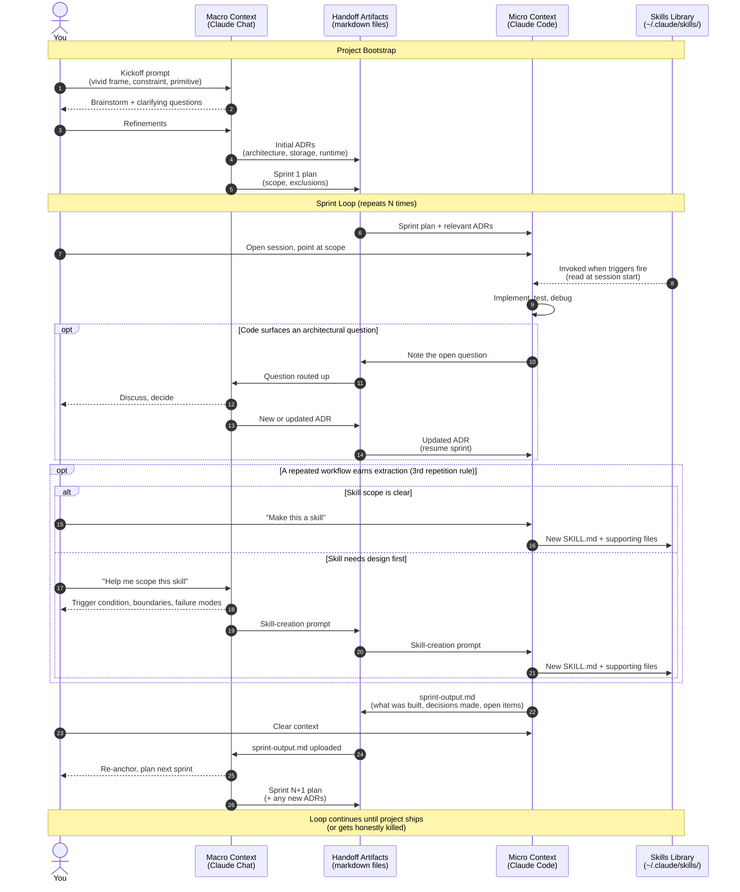

# Macro and Micro Contexts: A How-To

The single architectural choice that has shaped every project I have built with Claude over the last eight months is the separation between a macro context and a micro context. This document is the mechanical version — when to use which, what artifacts pass between them, and how to keep them honest. The autobiographical version of how I arrived at this — and what it cost me before I did — is in [Macro and Micro](https://whoisb.substack.com/p/macro-and-micro-how-i-manage-my-context) on the newsletter.

## The flow at a glance

The rest of this document walks through what each piece of the flow actually means.

## The two contexts

**Macro context lives in Claude Chat.** It is where I think out loud about the project as a whole. Requirements get discovered here. Architecture gets argued out here. ADRs get drafted here. The macro context is long-lived — sometimes weeks — and it accumulates a coherent understanding of *why* the project is shaped the way it is. The currency of the macro context is reasoning.

**Micro context lives in Claude Code.** It is where implementation happens. Files get written. Tests get run. Bugs get tracked down. The micro context is short-lived by design — one sprint, maybe a day — and it accumulates an intense, local understanding of *what* is in the repo right now. The currency of the micro context is execution.

The mistake I see most often (and made myself, for months) is trying to do both kinds of work in one context. Implementation conversations slowly choke architectural ones; architectural conversations slowly forget what the code actually does. Separating them lets each get sharper.

## When to use which

A rough heuristic: if I am about to write code or run a command, I want Claude Code. If I am about to write a sentence about *what* code or *why* code, I want Claude Chat.

More concretely:

| Use Claude Chat (macro) when... | Use Claude Code (micro) when... |
|---|---|
| Discovering requirements with the user (me) | Writing or modifying files |
| Arguing between architectural alternatives | Running, testing, debugging |
| Drafting or revising ADRs | Investigating the actual repo state |
| Planning a sprint from a clean slate | Executing inside a sprint |
| Reviewing what was just built at a high level | Reviewing diffs and concrete failures |

The boundary is not always crisp. Sometimes a Code session surfaces an architectural question; when it does, I write down the question, finish the implementation work I can finish, and take the question back to Chat. I do not try to resolve architecture inside Code, and I do not try to write code inside Chat.

## The handoff artifacts

What makes the separation actually work — rather than just being two conversations that drift apart — is a small set of markdown files that pass between them.

- **The kickoff prompt** (see [`../prompts/`](../prompts/)) starts the macro context. It is the seed.
- **ADRs** (see [`../adrs/`](../adrs/)) are produced in the macro context and consumed by the micro context. When I start a Code session, I tell it which ADRs are in scope.
- **Sprint plans** are produced in the macro context: a brief description of what the next sprint is trying to accomplish, what it can touch, and what it explicitly cannot.
- **Sprint outputs** (see [`../journals/`](../journals/)) are produced in the micro context at the end of each sprint and consumed by the macro context at the start of the next planning round. This is the loop-closing artifact.
- **The decisions log** (also in `../journals/`) is maintained across both contexts — Chat usually adds rows when a decision is made, Code sometimes adds rows for smaller calls made during implementation.

If any of these artifacts go missing or stale, the contexts drift. The fix when they have drifted is always the same: stop, refresh the artifacts, then resume.

## Keeping them in sync

The two practices that keep the contexts genuinely aligned over time:

1. **Clear the micro context at sprint boundaries.** A long-running Code session is a slow drift toward incoherence. The sprint-output file is what makes clearing safe.
2. **Re-anchor the macro context with the sprint output at the start of every planning conversation.** "Here is what we just built; here is what is open" — those two pieces of information let Chat plan from reality instead of from a remembered version of the project that is two sprints out of date.

That's the whole mechanism. Two contexts, a handful of files between them, and the discipline to keep the files current. Most of the leverage in this methodology comes from that single separation.

---

For the story of how I got here — the failed projects, the dead ends, what finally made the pattern click — see [Macro and Micro](https://whoisb.substack.com/p/macro-and-micro-how-i-manage-my-context) on the newsletter.
